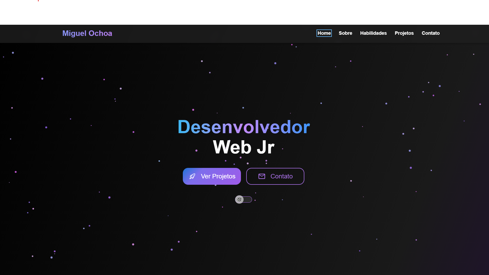

<h1 align="center"> Portifólio-Parte 1 </h1>

Projeto desevolvido por Miguel Ochoa. 

  <a href="#-tecnologias">Tecnologias</a>&nbsp;&nbsp;&nbsp;|&nbsp;&nbsp;&nbsp;
  <a href="#-projeto">Projeto</a>&nbsp;&nbsp;&nbsp;|&nbsp;&nbsp;&nbsp;
  <a href="#-layout">Layout</a>&nbsp;&nbsp;&nbsp;|&nbsp;&nbsp;&nbsp;
  <a href="#memo-licença">Licença</a>

 

## 🚀 Tecnologias

Esse projeto foi desenvolvido com as seguintes tecnologias:

- HTML5
- CSS3 + Flexbox
- Git e Github
- Figma
- Github Pages

## 💻 Projeto

Esta é a Parte 1 do meu projeto desenvolvido durante o curso **Tecnologia Web - Engenharia da Computação (Front-End)**. Trata-se de um site de portfólio pessoal com informações sobre mim, meus projetos e formas de contato.

## 🔖 Layout

Você pode visualizar o layout do projeto através [DESSE LINK](https://www.figma.com/design/M9zZBDFBjXYgHoWbT6zTTN/Portifólio?node-id=0-1&p=f&t=1Uj9BKpUWliYt5WZ-0). É necessário ter conta no [Figma](https://figma.com) para acessá-lo.

## 🔗 Acesso ao Projeto

- **GitHub Pages:** [Clique aqui para acessar o site](https://ochoamiguel.github.io/Portifolio-Parte1/)
- **Repositório GitHub:** [Acesse o código-fonte aqui](https://github.com/ochoamiguel/Portifolio-Parte1)

---

## 📸 Capturas de Tela

  

  

  

  

  

## :memo: Licença

Este projeto é de uso educacional, criado como parte da disciplina **Tecnologia Web**.

## 🙋‍♀️ Desenvolvido por

**Miguel Thomas Ochoa - RA: 256203**  
Turma: [Segundo Semestre de Engenharia da Computação]  
Email: miguelthomasochoa@gmail.com  
GitHub: [https://github.com/ochoamiguel](https://github.com/ochoamiguel)

---

Feito com ♥ by Miguel Ochoa :wave: 
